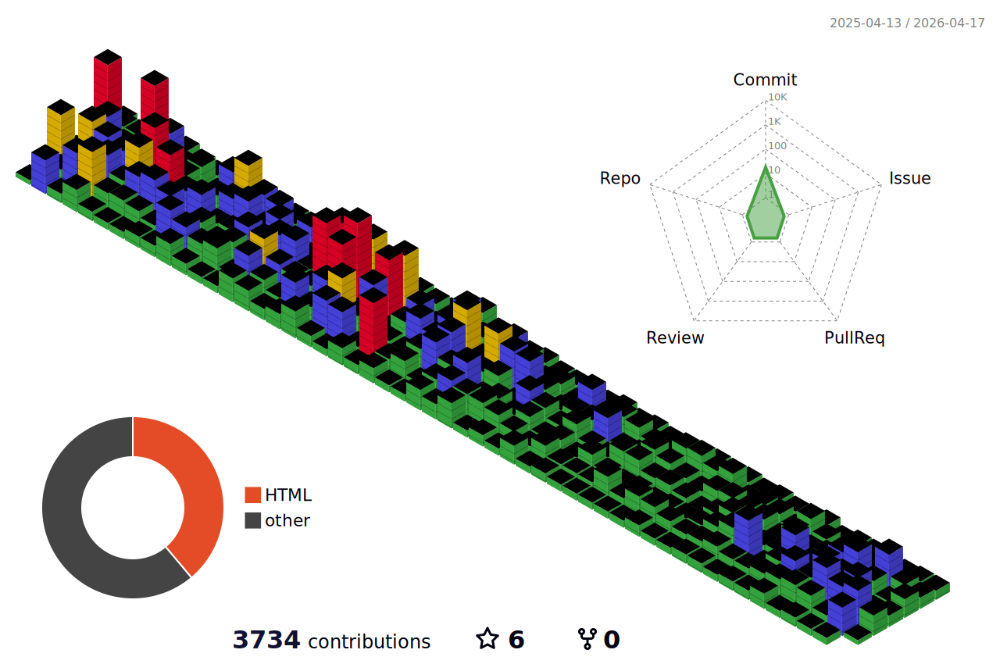

## Welcome! 👋

Hello :) I'm Jang Woojun, an Android app developer who loves mobile. 👋🏻  
I focus on building user-friendly experiences and proving my growth through actions, not just words.

## Current Challenge 🏆

I’m currently taking on the **Daily Commit** challenge!  
To follow my growth journey, visit [my blog](https://woojun.app/).

## Languages 👾

  
  
  
  
  
  

## GitHub Activity 🧩

